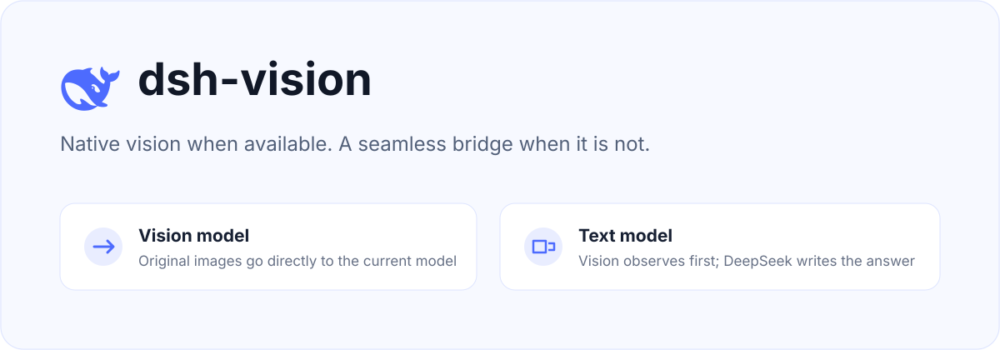
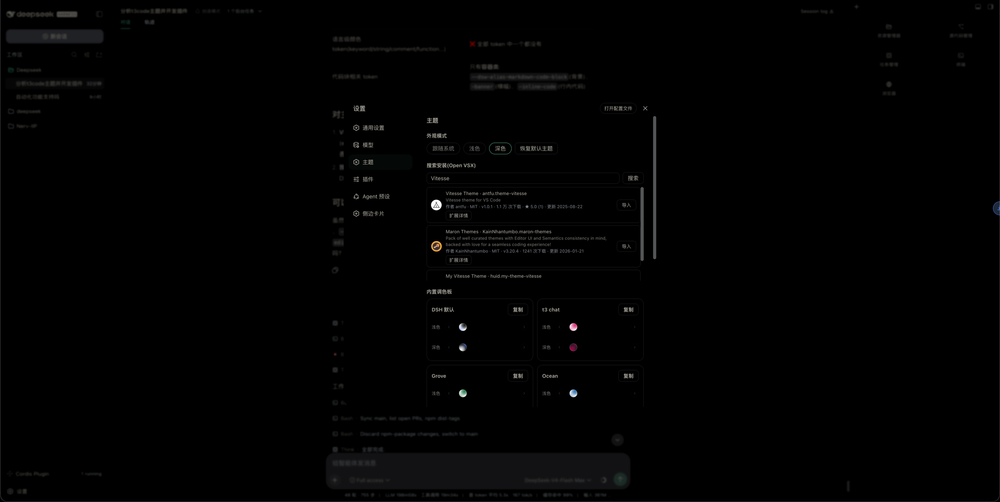

<p align="center">
  
</p>

# dsh-themes

[English](README_EN.md) | 中文

[](https://www.npmjs.com/package/dsh-themes)
[](https://github.com/MangMax/dsh-themes)

DSH(DeepSeek Harness)运行时的**外观与主题**插件:内置调色板、明 / 暗 / 跟随系统外观模式、Open VSX 搜索安装、VS Code 主题导入,主题库持久化。

> 主题引擎(语义角色映射、双种子生成、对比度求解、OKLCH 感知导入映射)的架构灵感来自
> [t3code](https://github.com/pingdotgg/t3code)



## 兼容性

<!-- 以下到引用块之前的列表是「兼容性事实」的唯一真相来源:
     版本号来自 package.json 的 peerDependencies 与 dshCompat 字段。
     scripts/install.sh 组装 npm 包时按同一份事实生成包内 README,并逐行校验本段;
     改这里就必须同步改 package.json,否则 bash scripts/install.sh --pack-only 会直接失败。 -->
- 需要 DSH `^0.1.5-rc.1 || ^0.2.0-rc.1`(通过 `peerDependencies` 声明,DSH 的插件兼容性门禁据此判定)
- 已在 **0.2.0-rc.2**(当前最新)、0.1.7-rc.2、0.1.5-rc.2 上验证
- 对 DSH 0.2.0 界面实际消费的 **86 个语义 token 全覆盖**(含 `--dsw-alias-state-idle-primary`),不再露出 DSH 原生色
- 客户端 Toast 使用 DSH 平台 seed word 模块 `@deepseek-ai/dsh-client-ui-primitives`(无需额外安装)
- Host 半区用 `connection.fetch.register` 注册精确 Fetch 路由 `/api/dsh-themes`,由 DSH 自有的 `/api` 前置路由转发并附带 trusted-host 检查与浏览器会话鉴权
- **不需要** 再在 profile 的 `cordis.patch.yml` 里给 `connection` 行补 `inject: [webRuntime, webServer]`(0.1.5 时代的临时绕行补丁,0.1.9 起可删除)
- 构建期守卫 `scripts/check-dsh-compat.mjs`(已接入 `pnpm check`)校验核心 token 集合、UI 语义 token 覆盖率与 `peerDependencies` 区间,防止再次漂移

> 细节:Host 半区不再使用 `connection.rpc.handle`,改为 `connection.fetch.register` 注册精确 Fetch 路由
> `/api/dsh-themes`:该路由由 DSH 自有的 `/api` 前置路由转发,自带 trusted-host 检查与浏览器会话鉴权,
> 且不需要消费方注入 `webServer`。0.1.7 起 `connection.rpc.handle` 会把路由挂到 connection 插件自身的
> fiber 上(`owner.effect(() => owner.webServer.register(…))`),消费方调用即抛
> `cannot get property "webServer" without inject`,所以上面那条「不需要补 inject」成立。

## 0.2.0:导入修复与提速

这一版解决「导入 Tokyo Night 报 *未贡献颜色主题*」。根因**不是**扩展的问题,而是本插件的解析器:

1. **VS Code 主题是 JSONC**。`enkia.tokyo-night` 的三个主题文件全部含 `//` 注释
   (第 87 行起有整段被注释掉的键),而旧实现用严格 `JSON.parse` 解析 → 三个文件全部失败 →
   宿主返回空主题列表 → 界面误报「未贡献颜色主题」。
   现在统一走 `jsonc-parser`(与 [t3code](https://github.com/pingdotgg/t3code) 同一套做法:
   `parse(text, errors, { allowTrailingComma: true })`),注释、尾随逗号、BOM 都能读,
   本地扫描 / URL / 粘贴 / VSIX 四条路径一致。
2. **浅色变体被判成深色**。Tokyo Night Light 的主题文件里写的是 `"type": "dark"`(上游笔误),
   只有扩展清单的 `uiTheme: "vs"` 说得对。现在按 t3code 的做法用**清单 uiTheme 覆盖文件 type**,
   浅色变体终于能出现在明色槽里。
3. **导入提速**:
   - **按需解压**:VSIX 里体积最大的是 readme / changelog / 图标 / `.itermcolors`,主题相关文件一定是
     `.json`。改用 `fflate` 的 `filter` 只解 JSON,不再全量 inflate。
   - **压缩载荷**:只保留调色板映射真正用到的 44 个 workbench 颜色键,丢掉 `tokenColors` /
     `semanticTokenColors`。实测 Tokyo Night 三个主题的最小化 JSON 载荷 **117,679 → 4,412 字节(-96.25%)**
   (对比口径:三个主题文件各自 `JSON.stringify` 后的字节数之和,即不裁剪时会发给客户端的数据量)。
   - **一次批量详情**:搜索后的作者/许可证补齐从 N 次 RPC 合并为 1 次 `open-vsx-details`。
   - **搜索缓存 + 短超时**:同一关键词 60 秒内直接命中内存;Open VSX 慢请求 10 秒即失败,
     不再让界面干等 90 秒。
4. **反馈用 Toast**:成功/失败提示改用 DSH 原生 `Toast`
   (`@deepseek-ai/dsh-client-ui-primitives` 的 seed word 模块),顶部居中、自带滑入/淡出动画、
   `z-index: 1100` 位于所有面板之上——不再渲染在设置页底部(那里根本看不到)。
5. **搜索有动画**:输入 350 ms 去抖自动搜索、回车立即搜索(跳过输入法组字)、
   输入框内联 spinner、结果区加载态、结果行渐入,并尊重 `prefers-reduced-motion`。
6. **集成回归测试**:`node scripts/e2e-import.mjs` 用真实的 Tokyo Night VSIX 跑完整链路
   (52 项断言,含**冷缓存下载**这条曾经漏掉的路径),`node scripts/check-vs-keys.mjs` 保证颜色白名单永远覆盖映射器读取的每个键。

<!-- npm-readme:start — 以下区间会被 scripts/install.sh 抽进 npm 包内 README(不要放仓库开发向内容)-->

## 功能

- **主题卡片模型**:每个主题含明色/暗色两个变体槽,槽内聚合全部明色/暗色变体可选;导入的扩展聚合为一个主题卡片
- **默认主题卡片**:DSH 原生外观也是可选主题;删除使用中的导入主题或点击「恢复默认主题」均回退到它
- **变体选择器**:多色融合球列表(参照 t3code ThemePreviewCircle),选中放大(固定槽位不跳动)、溢出左右箭头导航、悬停显示变体名
- **外观模式**:跟随系统 / 浅色 / 深色,明暗变体随模式自动切换
- **搜索安装(Open VSX)**:单请求搜索(60 秒 TTL 缓存、10 秒超时),展示图标/作者/许可证/评分/更新时间;作者等详情一次批量补齐;输入去抖 + 内联 spinner + 结果渐入的搜索动画;「导入」一步完成下载、**按需解压**、解析(JSONC + include 合并)与聚合导入,版本化缓存重复导入秒开
- **VS Code 导入**:本地扩展扫描、URL 获取、粘贴 JSON,四条路径统一支持 **JSONC**(注释 / 尾随逗号 / BOM);清单 `uiTheme` 覆盖文件 `type`,浅色变体不再被误判;OKLCH 感知引擎派生表面,workbench 指定值对比度门控,操作色独立于 accent
- **提示用 Toast**:成功 / 失败反馈走 DSH 原生 `Toast`(顶部居中、自带动画、位于所有面板之上),不再内联在页面底部
- **状态动画色**:运行状态点阵(`--dsh-state-ongoing` → `--dsw-static-deepseek-450`)跟随主题
- **完整 token 覆盖**:DSH 设计平台 95 个颜色 token(表面层级 bg-layer-1~3 / 浮层 / 遮罩、文字层级 primary~caption、交互反馈、按钮、Markdown、状态补充、滚动条、Toast/Tooltip、侧栏与菜单等专用 token)全部随主题覆盖;「修改」编辑器按语义分组可调
- **设置页导航图标**:设置面板「主题」菜单图标替换为调色板图标(取自 reicon 图标集,https://github.com/dqev/reicon)
- **中英文界面**:设置页文案与提示跟随 DSH 语言设置(**设置 → 通用 → Language**),切换即时生效;主题库持久化数据保持语言中立,展示时自动本地化
- **持久化**:主题库保存到 `~/.dsh/dsh-themes.json`,重启后恢复
- **跨平台(Windows / macOS / Linux)**:网络与本地文件全部在宿主进程内完成(全局 `fetch` + node 内置模块 + `fflate` 内存解压),不依赖 shell 的 curl/mkdir/unzip 等 Unix 命令,Windows(pwsh)下同样可用

<!-- npm-readme:end -->
<!-- 标记区间到此为止:以下是仓库开发/构建/CI/发版说明,不进 npm 包 README -->

## 开发

源码为 **TypeScript 模块**,由 **VitePlus(`vp`)打包**为 DSH 插件函数体(`vite.config.ts` 的 `pack` 块负责构建)。

```bash
pnpm install             # 安装依赖(vite-plus 已声明为 devDependency,构建不再依赖全局 vp)
pnpm build               # vp pack → dist/client/index.cjs 与 dist/host/index.cjs
pnpm verify              # ★ 完整门禁 = build + check + test(CI 与发版用这个)

pnpm check               # 源码级:颜色白名单覆盖 + 中英文字典对齐 + DSH 兼容性(无需构建)
pnpm test                # 产物级:产物形状 + 真实 VSIX 端到端(需先 build)

bash scripts/install.sh              # 一键:构建 → 组装 npm 包 → 安装到 DSH profile
bash scripts/install.sh --pack-only  # 只构建并打包,不安装(CI 发版用)
DSH_PLUGIN_PROFILE=desktop bash scripts/install.sh   # 安装到其他 profile(默认 web)
```

> `scripts/install.sh` 优先用 `./node_modules/.bin/vp`(CI 里没有全局 `vp`),版本从
> `package.json` 读取,不再有两处版本号。
> 注意 `vp` 的原生插件在部分 Electron 自带 node 下会因签名 Team ID 不匹配而无法加载,
> 本地开发换用系统 / nvm 的 node 即可(例如 `PATH=$HOME/.nvm/versions/node/vXX/bin:$PATH vp pack`)。
> **`vite` 是别名**:`package.json` 里写的是
> `"vite": "npm:@voidzero-dev/vite-plus-core@<与 vite-plus 同版本>"`。
> vite-plus 0.3 起会校验这个别名(否则报
> `Expected @voidzero-dev/vite-plus-core@x, but found vite@y`),所以**升级 `vite-plus` 必须
> 把别名一起改成同版本**,改完先跑 `pnpm verify`。
> 当前:`vite-plus` **1.0.0-rc.0**(内含 vite 8.3.x),要求 Node `^22.19.0 || ^24.11.0 || >=26.0.0`。

> `pnpm check` 现在还会跑 DSH 兼容性检查 `node scripts/check-dsh-compat.mjs`:它定位真实 DSH 运行时,
> 校验核心 token 集合、UI 语义 token 覆盖率与 `peerDependencies` 区间。上游发版造成的契约漂移会在这里
> 直接失败,而不是等用户看到 DSH 原生色。包内 README 的兼容性行也由 `scripts/install.sh` 按
> `package.json` 的 `peerDependencies` + `dshCompat` 生成,组装时逐行校验根 README,杜绝两处各写各的。

### 结构

```
shared/            # 两侧共用(打进各自产物)
  jsonc.ts         #   宽松 JSONC 解析(jsonc-parser + 允许尾随逗号 + 去 BOM)
  vs-colors.ts     #   VS Code 颜色键白名单 + 压缩载荷(宿主 → 客户端的唯一主题形状)
client/src/        # 浏览器半区(设置页 UI、调色板引擎)
  color-utils.ts   #   RGB/HSL/WCAG 对比度、双种子调色板
  oklch.ts         #   OKLCH 感知引擎(导入派生)
  chat.ts          #   t3 chat 调色板(t3.chat 界面取色,颜色保持原样)
  vs-import.ts     #   VS Code 主题解析与映射
  toast.ts         #   基于 DSH 原生 Toast 的提示队列
  palette.ts       #   token 清单、默认外观、内置主题
  styles.ts        #   设置页样式(含搜索/加载动画)
  index.ts         #   入口:状态/覆盖层/设置页/编辑器/注册
host/src/          # Node 半区(RPC)
  util.ts          #   跨平台网络/文件工具(可配超时与重试)
  index.ts         #   入口:扫描/读取/搜索/详情/安装/持久化
scripts/
  install.sh       #   一键构建 + 组装 npm 插件包 + 安装
  e2e-import.mjs   #   端到端导入回归(真实 Tokyo Night VSIX)
  check-vs-keys.mjs#   颜色白名单覆盖守卫
  check-dsh-compat.mjs # DSH 兼容性守卫(核心 token 集合 / UI 语义 token 覆盖率 / peer 区间)
```

## 发版(自动发布 npm)

一条命令搞定:改版本 → commit → tag → push,CI 接着跑门禁、发 npm、生成带 changelog 的 Release。

```bash
pnpm release     # bumpp(antfu):选版本号 → 更新 package.json → commit → tag vX.Y.Z → push
```

push tag 后 [`.github/workflows/release.yml`](.github/workflows/release.yml) 自动执行:

| 步骤 | 说明 |
|---|---|
| 校验 tag 与 `package.json` 版本 | 不一致直接失败,避免「tag 是 v0.3.0、发出去还是 0.2.0」 |
| `pnpm verify` | 完整门禁(构建 + 源码检查 + 产物检查 + 真实 VSIX 端到端) |
| 组装 + `npm publish` | 带 `--provenance` 签名;该版本已存在于 npm 时自动跳过(**幂等**,重跑不会因版本冲突变红) |
| `changelogithub` 生成 Release | 由 conventional commits / PR 分组生成的变更清单;`.tgz` 一并附到 Release |

之后 `dsh plugin add <Release 里 .tgz 的链接>` 就能装到指定版本。

也可以在 GitHub 上手动 **Draft a new release** 建 tag(旧习惯仍然有效 —— 工作流同时监听
`release: published`),或手动触发 `workflow_dispatch` 指定 tag 重跑。

**认证只需配一次(二选一,工作流两种情况都支持):**

- **A. npm 可信发布(OIDC,推荐,无需任何 secret)**:npmjs.com → 包 `dsh-themes` → Settings → Trusted Publisher → GitHub Actions,填 `MangMax` / `dsh-themes` / `release.yml`,Environment 留空。之后自动带 provenance 签名。
- **B. `NPM_TOKEN`**:仓库 Settings → Secrets and variables → Actions 新建 `NPM_TOKEN`,值用 **Granular Access Token**(Read and write + 勾选 Bypass 2FA)。配了就优先用它。

预发布版本(版本号带 `-`,或 Release 勾了 *prerelease*)会发到 npm 的 `next` tag,不会顶掉 `latest`。

## 安装

方式一(从 npm registry,已发布后):

```bash
dsh plugin --profile web add dsh-themes
```

方式二(本地一键构建安装,适合开发迭代):

```bash
bash scripts/install.sh
```

两种方式安装后均需**重启 dsh web**,然后进入 **设置 → 主题** 使用。

## 使用

- **外观模式**:跟随系统 / 浅色 / 深色;主题库默认未指定时由 DSH 默认主题兜底
- **明暗独立归属**:点击变体只设置该侧外观的主题,不切换外观模式;浅色与暗色可来自不同主题;点击卡片名称则明暗两侧同时使用该主题
- **颜色编辑器**:主题卡片「修改」进入二级页面——改名、明暗切换、分组 token 色块与 hex 编辑(即时生效)、重置修改
- **内置主题「复制」**:复制为自定义副本后再编辑,内置主题不可直接修改
- **从 VS Code 导入**:扫描本地扩展(`~/.vscode/extensions`、`~/.vscode-insiders/extensions`、`~/.cursor/extensions`)、URL 获取、粘贴 JSON;导入主题可修改、删除
- **搜索安装(Open VSX)**:搜索、查看卡片内简介与链接、一键导入(缓存秒开)

## 卸载

移除插件:

```bash
dsh plugin --profile web remove dsh-themes
```

或删除 profile 依赖后重启 dsh web。卸载后调色板覆盖层自动移除,外观恢复默认。
