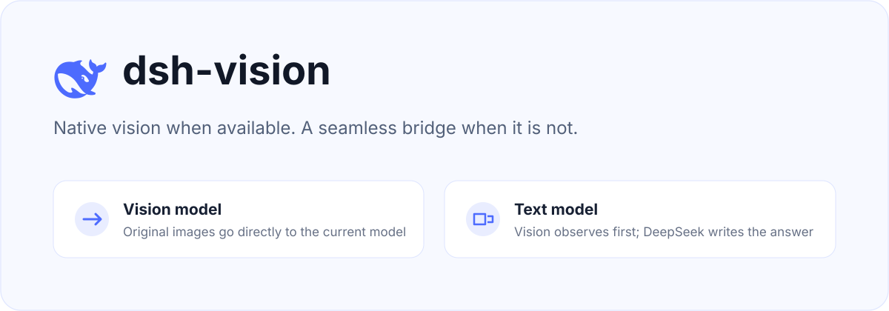
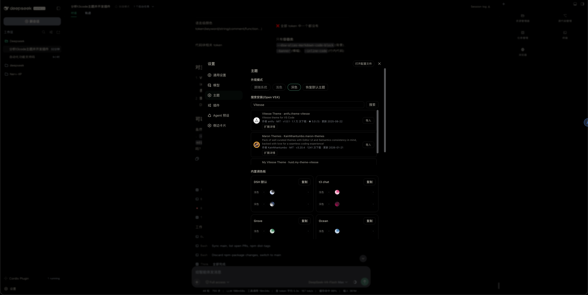

<p align="center">
  
</p>

# dsh-themes

English | [中文](README.md)

[](https://www.npmjs.com/package/dsh-themes)
[](https://github.com/MangMax/dsh-themes)

A **look & theme** plugin for DSH (DeepSeek Harness): built-in palettes, light / dark / follow-system appearance modes, Open VSX search & install, VS Code theme import, persisted theme library.

> The theme engine (semantic role mapping, dual-seed generation, contrast solving, OKLCH perceptual import mapping) is architecturally inspired by [t3code](https://github.com/pingdotgg/t3code).



## Features

- **Theme card model**: each theme has light/dark variant slots aggregating all variants of that side; imported extensions become one theme card
- **Default theme fallback**: the DSH native appearance is itself a selectable theme; deleting the in-use imported theme or clicking "Restore default theme" falls back to it
- **Variant selector**: blended color-ball list (like t3code's ThemePreviewCircle); selected ball enlarges in a fixed slot, overflow arrows navigate, active variants show a selection outline
- **Appearance modes**: system / light / dark; light and dark sides can belong to different themes independently
- **Color editor (second-level page)**: rename, light/dark tabs, grouped token color pickers + hex inputs with instant effect, and "Reset edits"
- **Open VSX search & install**: one-request search with icon/author/license/rating, description inline on cards, one-click import with versioned cache
- **VS Code import**: local extension scan, URL fetch, paste JSON; OKLCH-aware engine derives surfaces, workbench-specified values are contrast-gated
- **Settings nav icon**: the "Themes" entry in the settings panel gets a palette icon from the reicon icon set (https://github.com/dqev/reicon)
- **Persistence**: theme library saved to `~/.dsh/dsh-themes.json` and restored on restart

## Development

Source is modular **TypeScript** bundled by **VitePlus (`vp`)** into DSH plugin function bodies (see the `pack` block in `vite.config.ts`).

```bash
bash scripts/install.sh              # one-click: vp pack → assemble npm plugin package → dsh plugin install to web profile
bash scripts/install.sh --pack-only  # build & pack only, no install
vp pack                              # build only (dist/client/index.cjs & dist/host/index.cjs)
vp check                             # syntax check
```

### Structure

```
client/src/        # Browser half (settings UI, palette engine)
  color-utils.ts   #   RGB/HSL/WCAG contrast, dual-seed palettes
  oklch.ts         #   OKLCH perceptual engine (import derivation)
  chat.ts          #   t3 chat palette (colors taken from t3.chat as-is)
  vs-import.ts     #   VS Code theme parsing & mapping
  palette.ts       #   token list, default appearance, built-in themes
  styles.ts        #   settings page styles
  index.ts         #   entry: state / override layer / settings page / editor / registration
host/src/          # Node half (RPC)
  util.ts          #   shell/curl utility factory
  index.ts         #   entry: scan / read / search / detail / install / persist
scripts/
  install.sh       #   one-click build + assemble npm package + install
```

## Install

Via npm registry (after publish):

```bash
dsh plugin --profile web add dsh-themes
```

Local one-click build (for development iteration):

```bash
bash scripts/install.sh
```

Either way, **restart dsh web**, then use it under **Settings → Themes**.

## Usage

- **Appearance modes**: system / light / dark; unspecified sides fall back to the DSH default theme
- **Independent light/dark owners**: clicking a variant only sets that side's theme without switching the appearance mode; light and dark can come from different themes; clicking a card name assigns the theme to both sides
- **Color editor**: click "Edit" on a theme card — rename, light/dark tabs, grouped token color pickers + hex inputs (instant), and reset
- **Copy for built-in themes**: built-in themes cannot be edited directly; use "Copy" to create a custom copy first
- **VS Code import**: scan local extensions (`~/.vscode/extensions`, `~/.vscode-insiders/extensions`, `~/.cursor/extensions`), fetch from URL, or paste JSON; imported themes can be renamed/deleted
- **Open VSX search**: search, read inline descriptions and links, one-click import (cached)

## Uninstall

```bash
dsh plugin --profile web remove dsh-themes
```

Or remove the dependency from the profile and restart dsh web. On removal the palette override layer is disposed automatically and the appearance returns to default.
